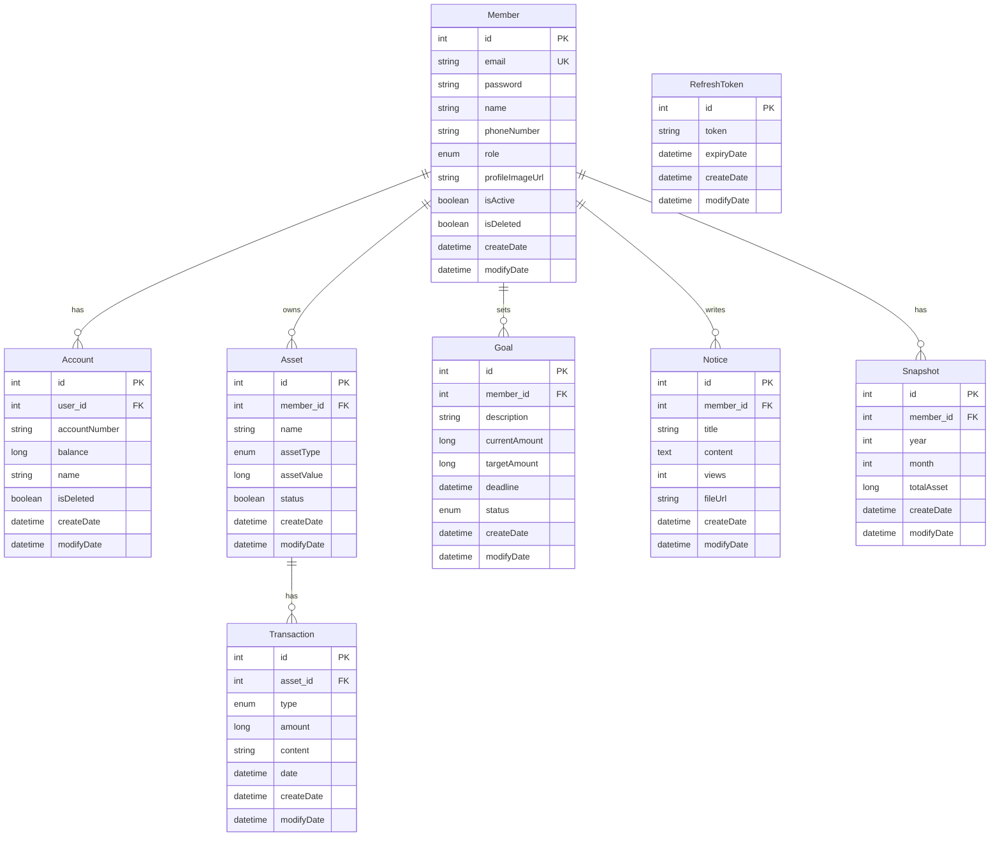
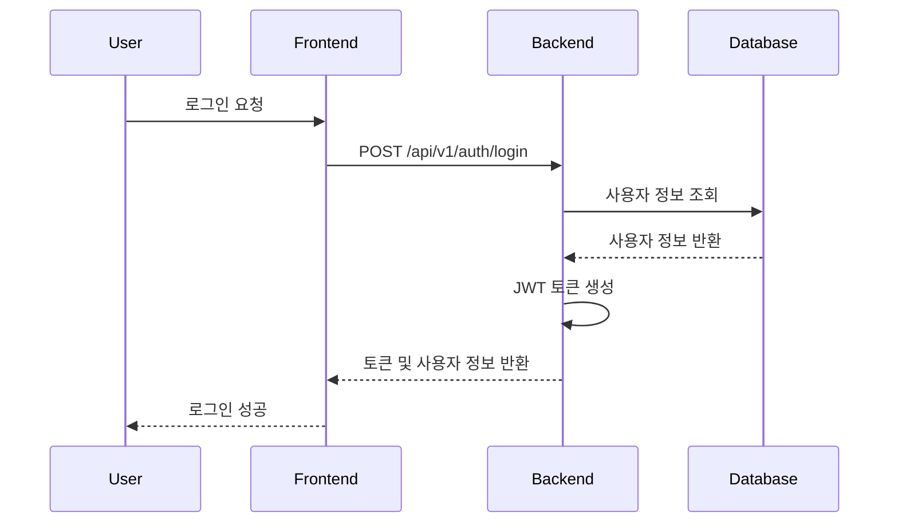
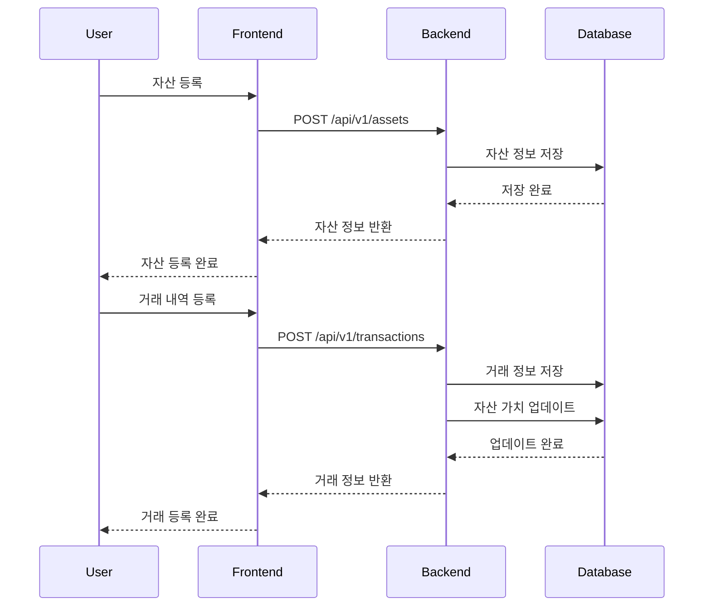
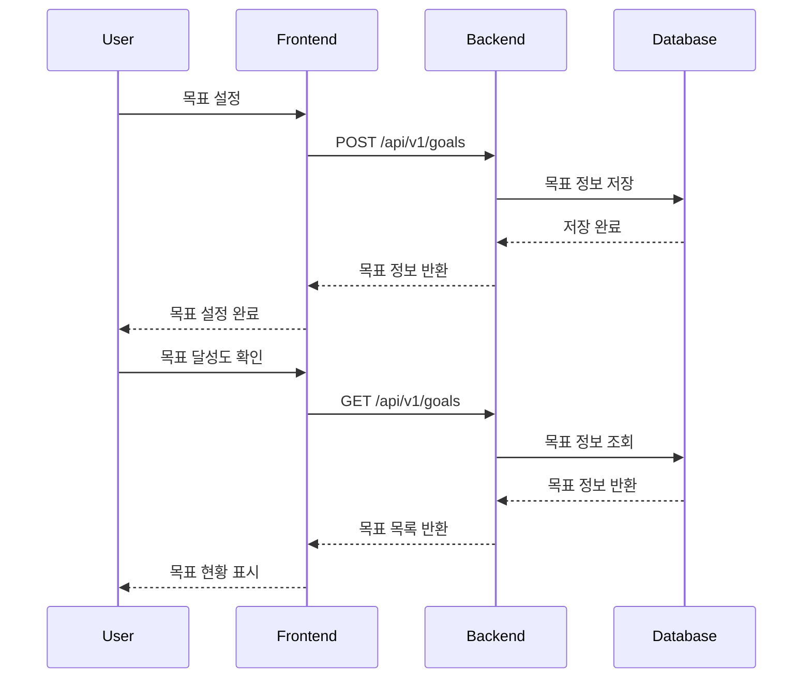
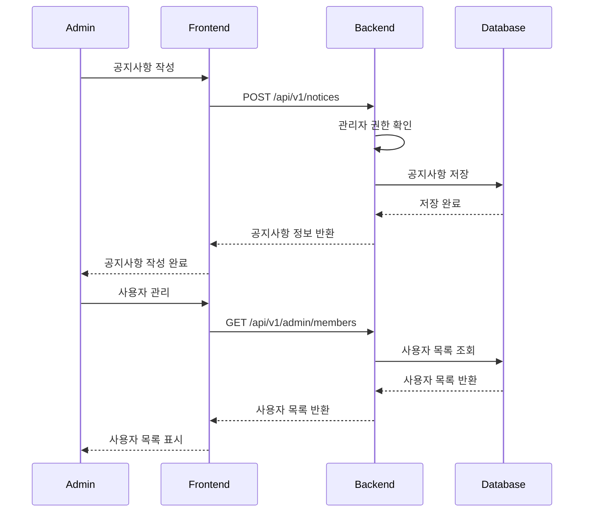

# NBE6-8-2-Team02 - 개인 자산 관리 시스템

## 📋 프로젝트 개요

이 프로젝트는 개인의 자산을 체계적으로 관리하고 목표를 설정하여 재무 계획을 수립할 수 있는 웹 애플리케이션입니다. 사용자는 계좌, 자산, 거래 내역을 관리하고 재무 목표를 설정하여 달성도를 추적할 수 있습니다.

## 👥 팀원

|이름|직책|작업|
|------|---|---|
|박영진|팀장|계좌 도메인|
|이준모|팀원|목표 도메인|
|김태경|팀원|사용자 & 인증 도메인, 스냅샷 도메인|
|이재균|팀원|자산 도메인, 전역 클래스|
|정의진|팀원|거래 & 공지사항 도메인, CI/CD 인프라|

## 🔄 CI/CD (Continuous Integration / Continuous Deployment)

#### CI/CD 파이프라인 개요
- 이 프로젝트는 GitHub Actions를 사용하여 백엔드와 프론트엔드의 CI/CD를 자동화했습니다.
- main 브랜치에 코드가 푸시되면 자동으로 테스트, 빌드, 배포가 수행됩니다.

#### 백엔드 배포 흐름
- 1. 코드 체크아웃: GitHub Actions가 레포지토리 코드를 가져옵니다.
- 2. 환경 변수/Secret 관리: DB 비밀번호, JWT 시크릿 등 민감 정보는 GitHub Secrets에 저장하고, 워크플로우에서 안전하게 참조합니다.
- 3. 애플리케이션 빌드: Gradle을 사용해 백엔드 JAR 파일을 빌드합니다.
- 4. 원격 배포: Fly.io를 통해 컨테이너를 배포하며, 최신 빌드가 자동으로 적용됩니다.
- 배포 URL: https://whitedoggy-backend.fly.dev/

#### 프론트엔드 배포 흐름
> [!NOTE]
> 프론트엔드는 따로 배포하지 않았습니다.

#### 테스트 및 품질 보증
- 백엔드: ./gradlew test를 통해 유닛/통합 테스트 자동 실행

#### 주요 장점
- 코드 푸시만으로 최신 버전이 자동 배포되어 운영 효율성을 높임
- Secret 관리와 환경 변수 분리를 통해 보안 강화
- Fly.io의 컨테이너 기반 배포로 일관된 실행 환경 제공

## 🚀 주요 기능

### 👤 사용자 관리
- 회원가입 및 로그인/로그아웃
- JWT 기반 인증 시스템
- 사용자 프로필 관리
- 비밀번호 재설정

### 💰 계좌 관리
- 계좌 등록, 수정, 삭제
- 계좌별 거래 내역 관리
- 계좌 잔액 추적

### 📊 자산 관리
- 다양한 자산 유형 지원 (예금/적금, 주식, 부동산)
- 자산 가치 추적
- 자산별 거래 내역 관리
- 월별 스냅샷 기능으로 자산 변화 추적

### 🎯 목표 관리
- 재무 목표 설정 및 관리
- 목표 달성도 추적
- 목표별 현재 금액과 목표 금액 비교
- 목표 상태 관리 (시작 전, 진행 중, 완료)

### 📈 거래 내역
- 수입/지출 거래 기록
- 거래 유형별 분류 (추가/제거)
- 거래 날짜 및 메모 관리
- 자산별 거래 내역 조회

### 📢 공지사항
- 관리자 공지사항 작성 및 관리
- 공지사항 조회, 수정, 삭제

### 🔐 관리자 기능
- 사용자 관리
- 시스템 분석 및 통계
- 보안 설정
- 관리자 설정

## 🛠 기술 스택

### Backend
- **Java 21**
- **Spring Boot 3.5.3**
- **Spring Security** - 인증 및 권한 관리
- **Spring Data JPA** - 데이터 접근 계층
- **H2 Database** - 개발용 데이터베이스
- **JWT** - 토큰 기반 인증
- **SpringDoc OpenAPI** - API 문서화
- **Gradle** - 빌드 도구
- **JUnit 5** - 테스트 프레임워크

### Frontend
- **Next.js 15.4.2** - React 프레임워크
- **React 19.1.0** - UI 라이브러리
- **TypeScript** - 타입 안전성
- **Tailwind CSS** - 스타일링
- **Framer Motion** - 애니메이션
- **Radix UI** - 접근성 컴포넌트
- **Recharts** - 차트 라이브러리
- **Lucide React** - 아이콘

## 📁 프로젝트 구조

```
NBE6-8-2-Team02/
├── backend/                    # Spring Boot 백엔드
│   ├── src/main/java/com/back/
│   │   ├── domain/            # 도메인별 패키지
│   │   │   ├── account/       # 계좌 관리
│   │   │   ├── asset/         # 자산 관리
│   │   │   ├── auth/          # 인증 관리
│   │   │   ├── goal/          # 목표 관리
│   │   │   ├── member/        # 사용자 관리
│   │   │   ├── notices/       # 공지사항
│   │   │   └── transactions/  # 거래 내역
│   │   └── global/            # 공통 설정
│   └── src/test/              # 테스트 코드
└── frontend/                   # Next.js 프론트엔드
    ├── src/app/
    │   ├── admin/             # 관리자 페이지
    │   ├── auth/              # 인증 페이지
    │   ├── mypage/            # 마이페이지
    │   └── components/        # 공통 컴포넌트
    └── public/                # 정적 파일
```

## 🗄️ ERD (Entity Relationship Diagram)



## 🔄 시스템 Flow

### 사용자 인증 Flow


### 자산 관리 Flow


### 목표 관리 Flow


### 관리자 기능 Flow


## 🚀 설치 및 실행

### Prerequisites
- Java 21
- Node.js 18+
- npm 또는 yarn

### Backend 실행

1. **백엔드 디렉토리로 이동**
   ```bash
   cd backend
   ```

2. **Gradle 래퍼 권한 설정 (Linux/Mac)**
   ```bash
   chmod +x gradlew
   ```

3. **애플리케이션 실행**
   ```bash
   # Windows
   .\gradlew bootRun
   
   # Linux/Mac
   ./gradlew bootRun
   ```

4. **API 문서 확인**
   - Swagger UI: http://localhost:8080/swagger-ui.html

### Frontend 실행

1. **프론트엔드 디렉토리로 이동**
   ```bash
   cd frontend
   ```

2. **의존성 설치**
   ```bash
   npm install
   ```

3. **개발 서버 실행**
   ```bash
   npm run dev
   ```

4. **브라우저에서 확인**
   - http://localhost:3000

## 🔧 환경 설정

### Backend 설정
- `backend/src/main/resources/application.yml` - 기본 설정
- `backend/src/main/resources/application-dev.yml` - 개발 환경 설정
- `backend/src/main/resources/application-test.yml` - 테스트 환경 설정

### Frontend 설정
- `frontend/next.config.ts` - Next.js 설정
- `frontend/tailwind.config.js` - Tailwind CSS 설정

## 📚 API 문서

### 주요 API 엔드포인트

#### 인증
- `POST /api/v1/auth/login` - 로그인
- `POST /api/v1/auth/logout` - 로그아웃
- `POST /api/v1/auth/signup` - 회원가입

#### 계좌 관리
- `GET /api/v1/accounts` - 계좌 목록 조회
- `POST /api/v1/accounts` - 계좌 생성
- `PUT /api/v1/accounts/{id}` - 계좌 수정
- `DELETE /api/v1/accounts/{id}` - 계좌 삭제

#### 자산 관리
- `GET /api/v1/assets` - 자산 목록 조회
- `POST /api/v1/assets` - 자산 생성
- `PUT /api/v1/assets/{id}` - 자산 수정
- `DELETE /api/v1/assets/{id}` - 자산 삭제

#### 목표 관리
- `GET /api/v1/goals` - 목표 목록 조회
- `POST /api/v1/goals` - 목표 생성
- `PUT /api/v1/goals/{id}` - 목표 수정
- `DELETE /api/v1/goals/{id}` - 목표 삭제

#### 거래 내역
- `GET /api/v1/transactions` - 거래 내역 조회
- `POST /api/v1/transactions` - 거래 내역 생성
- `PUT /api/v1/transactions/{id}` - 거래 내역 수정
- `DELETE /api/v1/transactions/{id}` - 거래 내역 삭제

## 🧪 테스트

### Backend 테스트
```bash
cd backend
./gradlew test
```

### Frontend 테스트
```bash
cd frontend
npm run lint
```

## 📦 빌드

### Backend 빌드
```bash
cd backend
./gradlew build
```

### Frontend 빌드
```bash
cd frontend
npm run build
```

## 🔒 보안

- JWT 기반 인증 시스템
- Spring Security를 통한 권한 관리
- Rate Limiting 구현
- 입력 데이터 검증

## 📄 라이선스

이 프로젝트는 MIT 라이선스 하에 배포됩니다.


